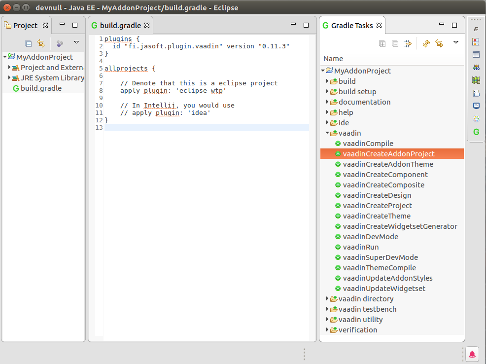
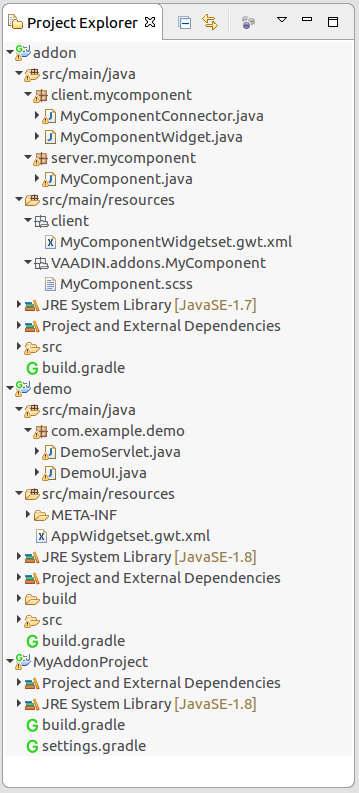

##Building addons

One of Vaadin's strengths is extensibility, and one of the foundations of that is the Vaadin Directory and its addons.

Addons are components that you can add to your project and use just as you would any Vaadin component. Addons can be server side only extensions of a Vaadin core component or it can have both a custom client side implementation and a custom theme if so needed.

###Creating a addon project
An addon project is a project that produces a *jar*-archive or *zip*-archive which can be uploaded to the directory or used straight in your project. 

When building an addon you  also want to create a some kind of demo project that uses the addon and verifies it is working. This project can be used by the addon users to try out the addon as well as by UI testing tools (like Vaadin Testbench) to test with.

The plugin provides a convenient method for creating this kind of addon project since 0.11.3.

To create a project you will need a starting point so start by creating a new project. 

You can do that either by using the console and creating a new folder and an empty **build.gradle** file :

```bash
mkdir myAddonProject
cd myAddonProject
echo "plugins { plugin { id 'fi.jasoft.vaadin' version '0.11.4'} }" > build.gradle
```

Or if you are using an IDE create a new simple Gradle project :




Next, run the **vaadinCreateAddonProject** task either by double clicking on the task or typing it in the console. 

**Note:**
In eclipse you need to refresh the project after the task has run. To do that right click on the project and select Gradle -> Refresh Gradle Project. A similar thing  might be needed for Intellij as well.

Once that task is ready and you have refreshed the project, the project should look like this:



You can run the project by running the **vaadinRun** task using ``gradle vaadinRun`` in the console.

The addon project consists of 3 modules; the parent module, the addon module and the demo module.


### The parent module

The parent module is the module you created, the addon and demo modules are its children.

After you have created the project you can remove the dependency to the Vaadin plugin from the parent module if you wish. Just remember to then add it to the demo and child modules or apply it in a ``subprojects { }``-clause in the parent **build.gradle**.

### The addon module

The addon module contains the addon itself. 

The addon jar that you upload to the Vaadin Directory can be found under **build/libs/**. If you just want to build it without building the rest of the projects you can run ``gradle :addon:jar`` in the parent module to generate the jar-archive.

The task creates a pre-configured component for you 3 parts; a server side part, a client side part and a theme.

The server side part is the class you will use in your application. It is called *MyComponent* by default.

The client side parts is the widget and the connector that connects the client side to the server side part. By default these are called *MyComponentWidget* and *MyComponentConnector*. If you don't need a client side implementation you are free to remove these two classes. You can also remove the widgetset if you do not have any client side code.

The theme is located under the **resourcecs** folder and is used to theme the component with. When the Vaadin application theme is compiled this theme will be included in the application theme. You can use it to style the component with Sass or if you don't need a theme for your component you can remove it.

### The demo module

The demo module is used to showcase your addon. 

It depends on the addon module so whenever you change the addon and run the demo the changes are immediately visible.

You can run the demo by running ``gradle :demo:vaadinRun`` from the console.

 

