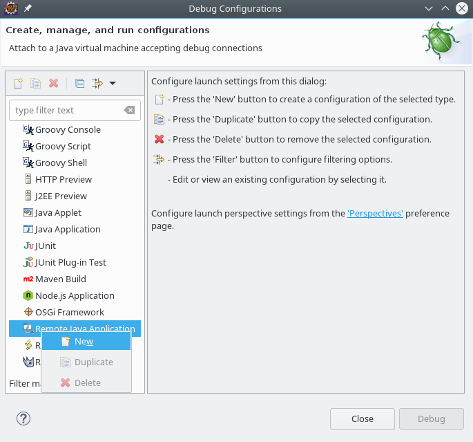
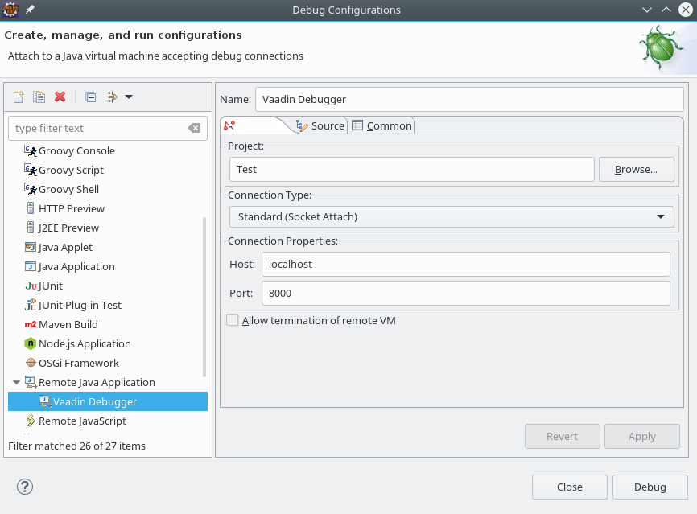
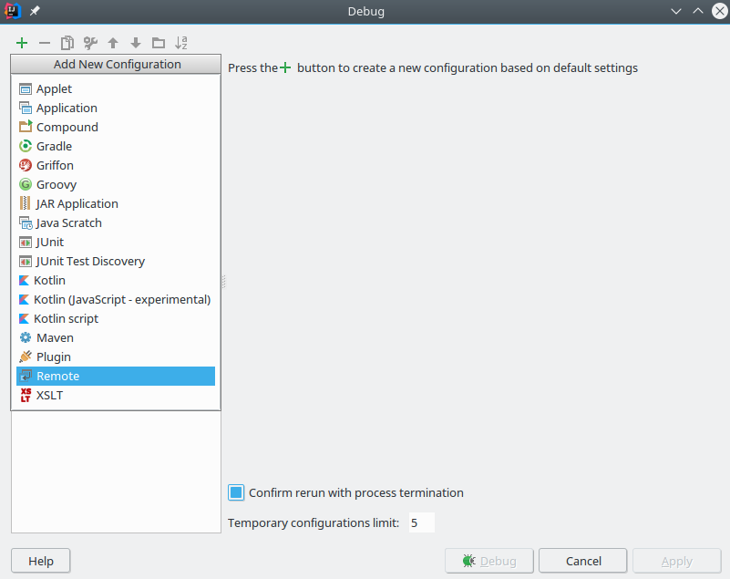
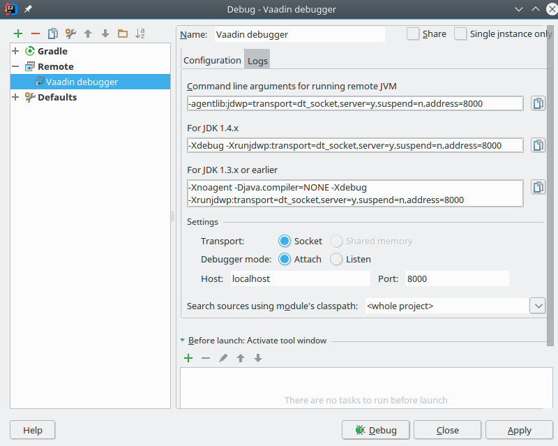

## Debugging your application

Okay, so you have created a project and are now running it with *vaadinRun*, how do you add breakpoints and debug your code?

### Debugging in Eclipse

When *vaadinRun* starts it will automatically attach a debugger to the the java process and expose that on port 8000. So to enable debugging you will need to create a launch configuration to attach eclipse to that port.

You can do that by selecting *Run-> Debug Configurations...* and in the following screen create a new **Remote Java Application** as I have done below.

Next, just select *Debug* and the debugger will attach itself to the running application and you can set breakpoints and step through your code.

Of course, if you are running on a WTP server and *not* using vaadinRun you don't need to 
create the debug launch configuration as the server will be started by eclipse and the debugger automatically be attached to it.

### Debugging in Intellij

Debugging in Intellij follows the same approach as in Eclipse.

Go to *Run -> Debug...* and select *Edit Configurations...*.

In the top left corner of the dialog press the "+" button and select **Remote** as I've done below.

Give the configuration a name and **ensure the port is 8000**. The configuration should look like this.

Click *Debug* and the debugger will attach to the running process and you are ready to set breakpoints and step through your code.

