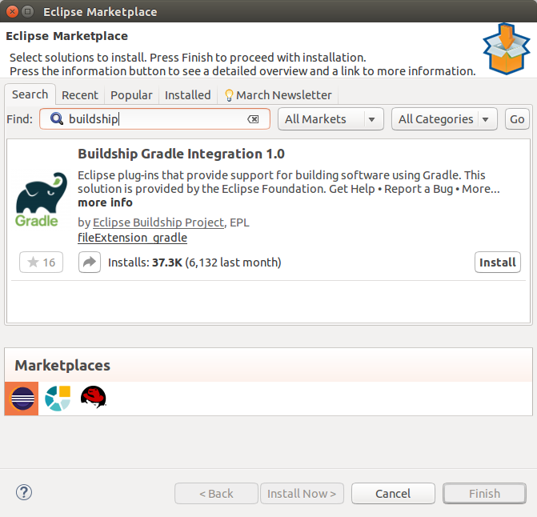

## Installing Gradle support in Eclipse
As of writing the Eclipse Gradle support is only bundled with the Java, Committer and RAP/RCP distributions of Eclipse Neon which means that if you are a Vaadin developer you most likely have the Java EE version and will need to manually install the Gradle support. Hopefully this will change in the future.

To install the Gradle support in Eclipse we need to install a eclipse plugin called Gradle BuildShip which is the official Gradle support provided by the Eclipse Foundation. We can do that from the Eclipse Marketplace by searching for “buildship” and pressing install.



## Creating a Vaadin Gradle Project

To create a Gradle project, we will use the Gradle Project wizard. 

So Select **File -> New -> Other -> Gradle -> Gradle Project** and select *Next*.

 

After you have select Next, there will be a short introduction screen presenting the features of the Gradle integration, whereafter if you click Next you will be asked to enter a name for your project. 

After you’ve entered the name select Next again, and the last page of the wizard will be displayed with some options how to handle the Gradle version. You can ignore these for now and just go with the recommended option and click Finish and the project will be created for you.

After you have created the project there will be some placeholder classes and an example **build.gradle** file created for you. We don’t need any of it, so you can just go ahead and remove the src-folder and empty the **build.gradle** file so it is just an empty file. 

To make the project a Vaadin project we need to add a Vaadin plugin to our build file. This can be done by adding the following snippet to your **build.gradle**:

```gradle
// Tell Gradle to add Vaadin support
plugins {
  id 'fi.jasoft.plugin.vaadin' version '0.11.0-beta'
}

// Tell Gradle that we are working in eclipse
apply plugin: 'eclipse-wtp'
```
Once you have done that and you have saved the file press the  -button in the *Gradle Tasks** view to refresh the tasks of the project. After it has run you should see many more task categories listed in the *Gradle Tasks* view, among the important ones being the ide and the vaadin categories.

Next in the *Gradle Tasks* view, execute the **eclipseWtp** task by double clicking on it under *ide -> eclipseWtp*.This will setup the eclipse workspace files correctly.

Since we removed all source files previously, we next want to create a project skeleton so we don’t need to write anything from scratch. So we can use the **vaadinCreateProject** task to do that for us. It can be found under the *vaadin* category in the *Gradle Tasks* view. Just double click on it to run it.

Finally we need to refresh the project, so our Vaadin project dependencies are downloaded and our workspace is refreshed with the newly created project files. To do that, right click on your project in the *Project Explorer* and select *Gradle -> Refresh Gradle Project*.

Once that is done the project setup is complete and your project should look like in the following screen capture. We are now ready to run it.


## Running the project

There are two ways you can run the project, either with the vaadinRun task that comes with the Gradle Vaadin Plugin, or with standard Eclipse WTP.

### Running the project with vaadinRun
The plugin comes with a full JEE application server bundled. 

Whenever you want your project you can just double click on the vaadinRun in the vaadin category in the Gradle Tasks view and the project will be deployed to the server and the server run. An external browser tab will be opened when the project has been deployed and is ready to be used.

If you want to automatically re-deploy the application when the server is running and you develop your application, you need to add the following to the build.gradle file to tell gradle where to find the changed class files:

```gradle
// Tell vaadinRun where eclipse puts its modified classes
vaadinRun.classesDir = 'bin'
```

Whenever a class changes the server will then re-deploy.

Stopping the server can be done by pressing the  in the Gradle Executions view. Stopping the server might take some time so be patient, it takes a while for the Gradle process to finish.

### Running the project with Eclipse WTP
Since we are working in Eclipse we can also use just the standard Eclipse WTP server configurations to run the projects with. In that case just configure an appropriate server like Tomcat or TomEE and add the project to the server.


