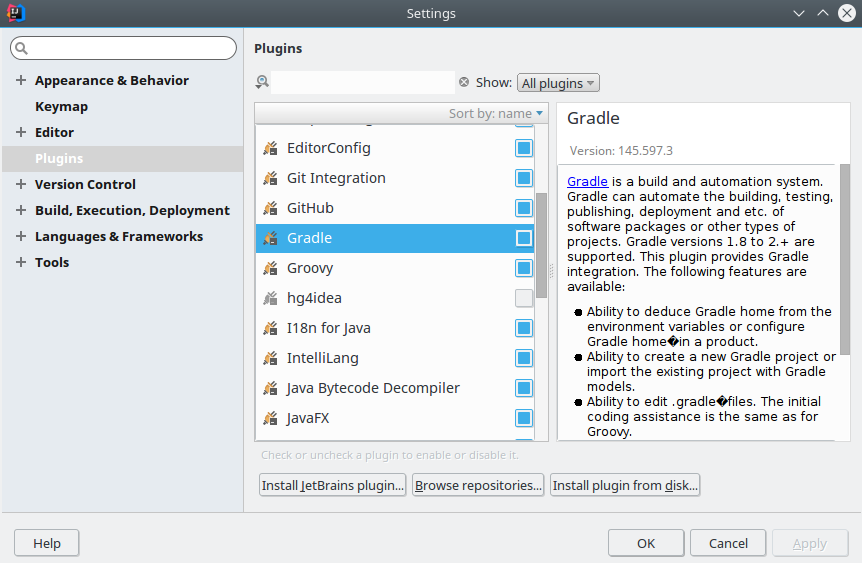
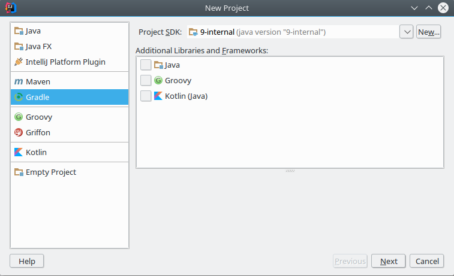
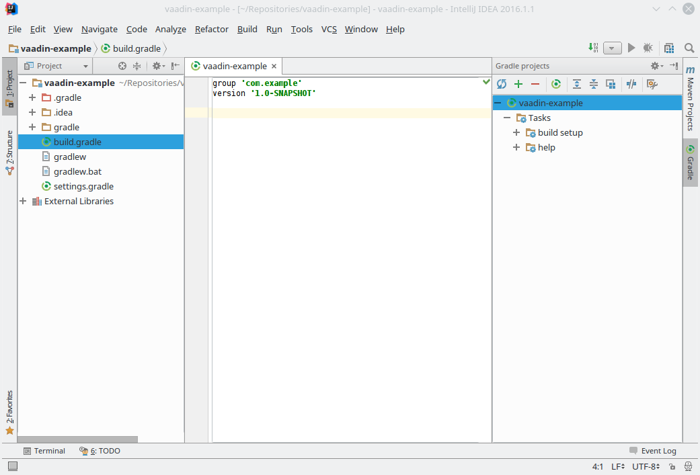
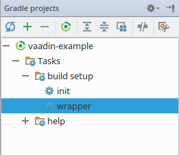
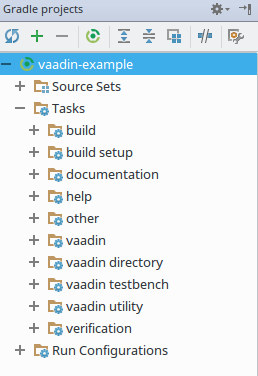
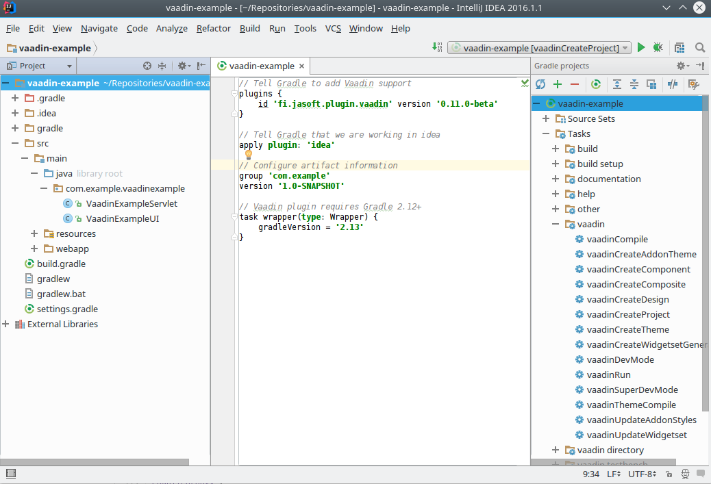
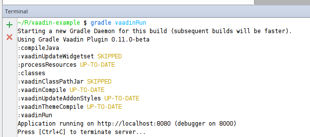

## Enabling Gradle support in Intellij

Intellij IDEA comes with full Gradle support out-of-the-box, but depending on what plug-ins you selected to enable when you installed the IDE you might have it disabled.

To enable the Gradle support go to **File->Settings** and ensure that under *Plugins* category the **Gradle** plugin is checked.




## Creating a Gradle project

To create a new project select **File->New->Project...** , select *Gradle* and click *Next*. Uncheck any extra libraries that might be selected, Gradle will take care of them for us.



In the next screen of the wizard type in a **GroupId** and a **ArtifactId** and click *Next*. 
The defaults or totally ok for us, so keep clicking *Next* until you see a *Finish* button and finally click the *Finish* button to create the project.

It will take a while for the project to be created so be patient.

Once the project has been created, there is one thing we have to do , and  that is open the **Gradle Projects** control panel, so we can see the tasks Gradle provides.

To do that, click on the  and select **Gradle**. That will pop up the Gradle panel to the right on the workspace.

This is how it would roughly look once that has been done:



Now, all that remains is making this project a Vaadin project.

Unfortunately before we can configure the Vaadin project we need to update the Gradle version for the project since Intellij ships with an old version of the Gradle wrapper which the Vaadin plugin cannot use. To do that, open up **build.gradle** and add the following to configure the *Gradle Wrapper* version:

```gradle
// Vaadin plugin requires Gradle 2.12+
task wrapper(type: Wrapper) {
	gradleVersion = '2.13'
}
```

That will configure the wrapper to take Gradle 2.13 into use in your project. Finally, we need to run the **wrapper** task so the new Gradle distribution is downloaded and installed into your project. To do that go to the *Gradle Projects* panel and double-click on the **wrapper** task in the *build-setup* category:



Once the wrapper task has run (might take some time as it downloads Gradle from the internet), you should see something like this in the console:


Now we are ready to configure the project to become a Vaadin Project!

Open up the  **build.gradle** file, if you don't already have it open, and add the following before the group and version definitions:

```gradle
// Tell Gradle to add Vaadin support
plugins {
  id 'fi.jasoft.plugin.vaadin' version '0.11.0-beta'
}

// Tell Gradle that we are working in idea
apply plugin: 'idea'

```

Then press the  -button in the *Gradle Projects** panel to initialize the project. This might take a while since all Vaadin dependencies will now get downloaded and configured for the project.

Once the refresh is complete you should see four new task categories in the *Gradle Projects* panel:



Now that the project is correctly set up we still want to create the correct folder structure for the project along with some example code to get started. To do that, run the **vaadin/vaadinCreateProject** task. It will create the necessary folders and add a example Vaadin UI.

This is what the workspace should look like if everything went ok



## Running the project

Unfortunately, we can't run the project from the *Gradle Projects* panel as it does not support long running processes, so instead we will need to run in the Terminal.

However, it is not really hard. Click on the -button and select **Terminal**. That will add a terminal tab to the lower part of Intellij.

Now when you want to run the project, just type in ``gradle vaadinRun`` and the project will run. 



A benefit from running from the terminal is that you can see the server logs directly as you run the application if you add ``vaadinRun.logToConsole true`` to **build.gradle**.


